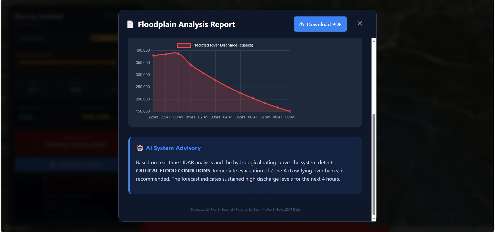

# Team Riverly

<div align="center">

  <h1 align="center">AI-Driven River Health Dashboard</h1>

  <p align="center">
    A next-generation disaster management dashboard for the <strong>Haridwar Ganga Basin</strong>. This dashboard combines real-time telemetry, historical climate data, and sub-meter precision LiDAR to predict flood risks and automate zonation alerts before disaster strikes.
  </p>

<p align="center">
  <a href="https://github.com/Kyash04/Riverly-Sentinel">
    
  </a>
  <a href="https://github.com/Kyash04/Riverly-Sentinel">
    
  </a>
  <a href="https://github.com/Kyash04/Riverly-Sentinel">
    
  </a>
  <a href="LICENSE">
    
  </a>
</p>

<br/>

[**Explore the Docs »**](#getting-started)
·
[**View Demo**](#screenshots)
·
[**Report Bug**](https://github.com/Kyash04/Riverly-Sentinel/issues)
·
[**Request Feature**](https://github.com/Kyash04/Riverly-Sentinel/issues)

</div>

---

<details open="open">
  <summary><h2 style="display: inline-block">Table of Contents</h2></summary>
  <ol>
    <li><a href="#about-the-project">About The Project</a></li>
    <li><a href="#key-features">Key Features</a></li>
    <li><a href="#technology-stack">Technology Stack</a></li>
    <li>
      <a href="#getting-started">Getting Started</a>
      <ul>
        <li><a href="#prerequisites">Prerequisites</a></li>
        <li><a href="#installation--setup">Installation & Setup</a></li>
        <li><a href="#the-crucial-manual-step-lidar-data"> Manual Data Setup</a></li>
      </ul>
    </li>
    <li><a href="#usage">Usage</a></li>
    <li><a href="#screenshots">Screenshots</a></li>
    <li><a href="#project-structure">Project Structure</a></li>
    <li><a href="#roadmap">Roadmap</a></li>
    <li><a href="#contributors">Contributors</a></li>
    <li><a href="#acknowledgments">Acknowledgments</a></li>
  </ol>
</details>

---

## About The Project

**River Health Dashboard** is designed to solve a critical problem: outdated, static flood maps that fail during dynamic climate events. By creating a live **Digital Twin** of the river basin, authorities gain unprecedented situational awareness.

Unlike traditional systems that rely solely on rain gauges, our dashboard integrates **High-Resolution GeoTIFF LiDAR data** (official government sources) with an AI engine trained on **10 years of historical hydrological patterns** (2014-2024). This allows for precise estimation of river discharge and immediate visualization of inundated households in 3D.

The system features a robust **"God Mode" Simulator**, allowing disaster response teams to wargame scenarios (e.g., _"What happens if a 300mm cloudburst hits tonight?"_) and generate actionable PDF reports instantly.

---

## Key Features

Riverly provides a comprehensive suite of tools focused on precision, prediction, and proactive response.

* **AI-Powered Forecasting Engine:**
    * Utilizes a **Random Forest Classifier** trained on a decade of climate data.
    * Predicts river discharge (cusecs) and determines risk levels (Safe, Warning, Critical) with high accuracy.
    * Provides a **12-Hour Forward Forecast** graph, moving beyond simple current-state monitoring.

* **Precision LiDAR Zonation & 3D Visualization:**
    * **Sub-Meter Accuracy:** Processes multi-gigabyte NHP/NMCG GeoTIFF files to map terrain elevation down to the centimeter.
    * **Automated Death Zone Detection:** Algorithms scan terrain files to identify areas < 296m elevation, instantly visualizing red "danger zones" at risk of immediate inundation.
    * **Immersive 3D Map:** Built on **Mapbox GL JS** for realistic terrain rendering and satellite imagery.

* **"God Mode" Simulation Suite:**
    * A dedicated sandbox environment for scenario testing.
    * Manually inject extreme weather events (e.g., drag slider to "250mm Rainfall") to instantly visualize the theoretical flood wave and AI system response.

* **Automated Actionable Reporting:**
    * One-click generation of professional **Floodplain Analysis PDF Reports**.
    * Includes forecast charts, current telemetry, estimated households at risk, and AI-generated advisory text for decision-makers.

* **High-Performance Geospatial Querying:**
    * **Smart Coordinate Optimization:** Implements intelligent precision rounding (~11m grid) to group nearby queries.
    * **Zero-Latency Response:** Drastically reduces disk I/O operations on massive LiDAR datasets, ensuring instant elevation feedback even under high user load.

---

## Technology Stack

The project utilizes a robust, decoupled architecture combining high-performance Python data processing with a modern React frontend.

| Category | Technology |
| :--- | :--- |
| **Frontend**    |     |
| **Backend API** |                                                                                                                                                                                                                     |
| **AI & ML**     |                                                                                               |
| **Geospatial**  |                                                                                                                                                                                                                |     |
| **Data & APIs** | Official NHP GeoTIFF LiDAR, Open-Meteo Historical & Live API                                                                                                                                                                                                                                                                                                                                                             |

---

## Getting Started

To get a local copy up and running, please follow these steps critically.

### Prerequisites

- **Python** (v3.9 or newer recommended)
- **Node.js** (v16 or newer)
- **Git**

### Installation & Setup

#### 1. Clone the Repository

```bash
git clone https://github.com/Kyash04/Riverly-Sentinel.git
cd Riverly-Sentinel
```

#### 2. Backend Setup (Python/Flask)

Navigate to the root directory and install the required Python libraries.

```bash
# Ensure you are in the root /Riverly-Sentinel directory
pip install -r requirements.txt
```

#### 3. Frontend Setup (React)

Open a new terminal, navigate to the frontend folder, and install dependencies.

```bash
cd frontend
npm install
```

### THE CRITICAL MANUAL STEP (LiDAR DATA)

**STOP!** You cannot run the application yet. Due to GitHub file size limits, the massive LiDAR datasets are not included in the repo. You must add them manually.

> **Action Required:**
>
> 1.  Create a new folder named **`tiles`** inside the project root directory (`/Riverly-Sentinel/tiles/`).
> 2.  **Download** the high-resolution `.tif` files from the provided shared team drive location (Folder: `NHP_3_14`).
> 3.  **Paste all `.tif` files** directly inside your newly created `tiles` folder.

_Failure to do this will result in the backend crashing upon startup as it cannot find the terrain data._

## Usage

Once the installation and manual data setup are complete, you need to run two terminals simultaneously.

#### Terminal 1: The Backend Brain & AI

```bash
# Make sure you are in the root folder

# 1. Train the AI Model (Only needs to be run once)
python train_flood_ai.py

# 2. Scan LiDAR for Danger Zones (Only needs to be run once)
# This generates the death_zones.json file for the frontend
python scan_risk.py

# 3. Start the Flask API Server
python app.py
```

#### Terminal 2: The Frontend Interface

```bash
cd frontend
npm run dev
```

The application will launch in your browser at `http://localhost:5173 `

## Screenshots

### 1. The Main Dashboard (Live Mode)

_Real-time telemetry showing safe conditions, with LiDAR inspection points visible along the river bank._


### 2. "God Mode" Simulation (Critical Flood)

_Manual injection of 250mm rainfall triggering the AI model. The map instantly visualizes the massive red danger zones based on LiDAR data._


### 3. Automated PDF Report Generation

_An actionable report generated instantly, showing the 12-hour forecast curve and household risk assessment. The first picture demonstrates the scenario during live monitoring and the other 2 shows during the simulation mode._




## Project Structure

A high-level overview of the project's architecture.

```bash
Riverly-Sentinel/
├── frontend/                  # React Frontend Directory
│   ├── public/                # Static assets (death_zones.json lives here after scan)
│   ├── src/
│   │   ├── components/        # Reusable UI components (ReportModal.jsx)
│   │   ├── App.jsx            # Main application logic & Mapbox Integration
│   │   └── main.jsx           # Entry point
│   ├── package.json           # Frontend dependencies
│   └── vite.config.js         # Vite configuration
├── tiles/                     # [MANUAL] Folder holding GBs of .tif LiDAR files
│   ├── NHP_2253313.tif        # (Example file)
│   └── ...
├── .gitignore                 # Specifies files to ignore in git
├── app.py                     # Core Flask Backend Server & API endpoints
├── flood_model.pkl            # Trained Random Forest AI Model (Binary)
├── requirements.txt           # Backend Python dependencies
├── scan_risk.py               # Utility script to process LiDAR & define danger zones
├── train_flood_ai.py          # Utility script to fetch historical data & train AI
└── README.md                  # Project documentation
```

## Roadmap

- [ ] **Satellite Radar Integration:** Incorporate Sentinel-1 SAR data for real-time flood extent mapping during cloud cover.
- [ ] **Mobile Alert App:** A companion mobile application for push notifications to residents in danger zones.
- [ ] **Multi-Basin Support:** Scaling the architecture to support other flood-prone river basins in India.
- [ ] **IoT Sensor Fusion:** Integrating ground-based river gauge sensors for hyper-local validation of AI predictions.

## Contributors

Made by **Team River.ly** for **[RIVERATHON]**.

- **Yash Kumar** - [LinkedIn](linkedin.com/in/yash-kumar-dev) | [GitHub](https://github.com/Kyash04)
- **Swati Bharti** - [LinkedIn](https://www.linkedin.com/in/swati-bharti-29sb) | [GitHub](https://github.com/swati-bharti29)
- **Nishu Priya** - [LinkedIn](linkedin.com/in/nishupriya0) | [GitHub](https://github.com/NishuPriya01)
- **Kunal Kumar Jha** - [LinkedIn](https://www.linkedin.com/in/kunal-jha45) | [GitHub](https://github.com/Sasrirr)

## Acknowledgments

Special thanks to the open-source community and the creators of the libraries used in this project:

- **Amity University Noida** For providing the crucial high-resolution LiDAR GeoTIFF data.
- **Open-Meteo:** For their excellent historical and live weather APIs.
- **Mapbox:** For the powerful 3D mapping and visualization platform.
- **React & Chart.js:** For the frontend framework and data visualization tools.
