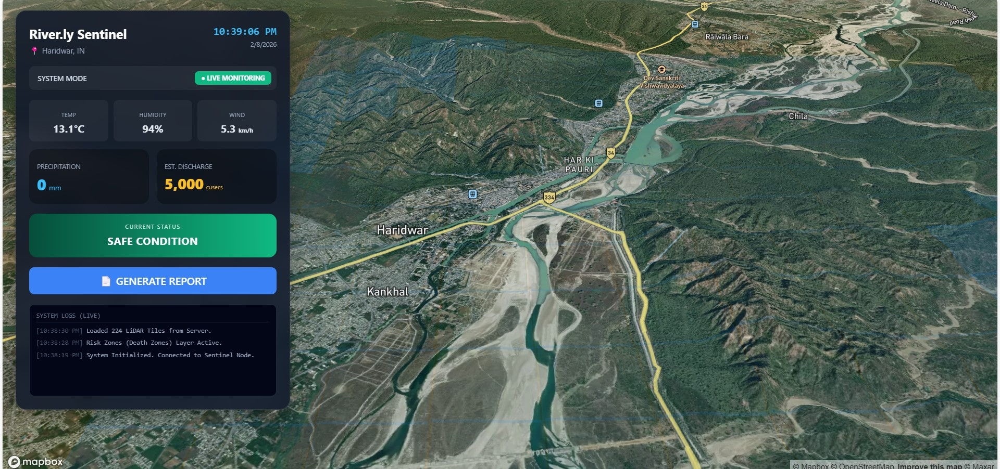
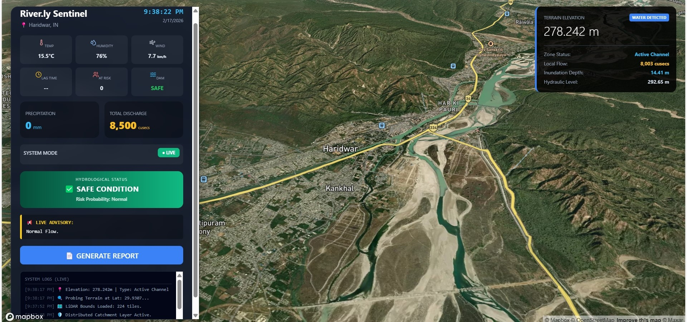
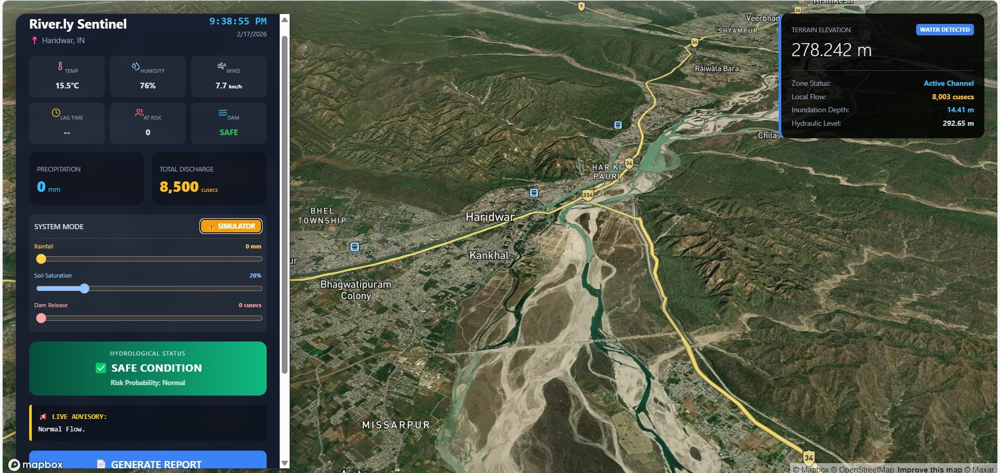
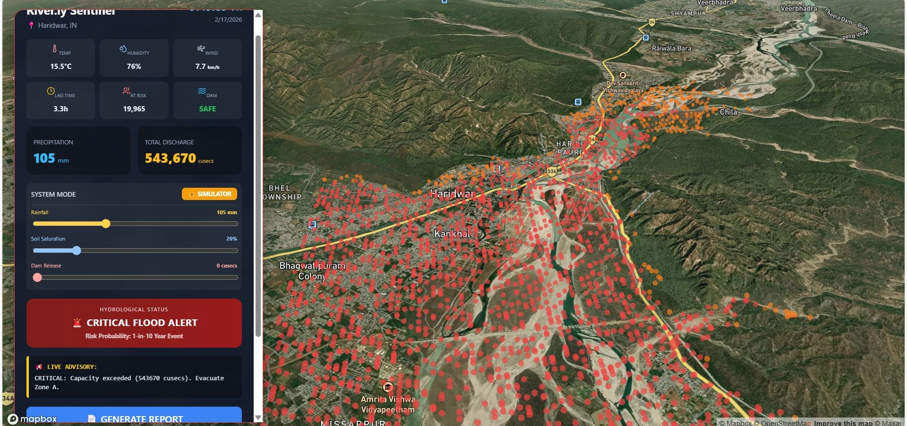
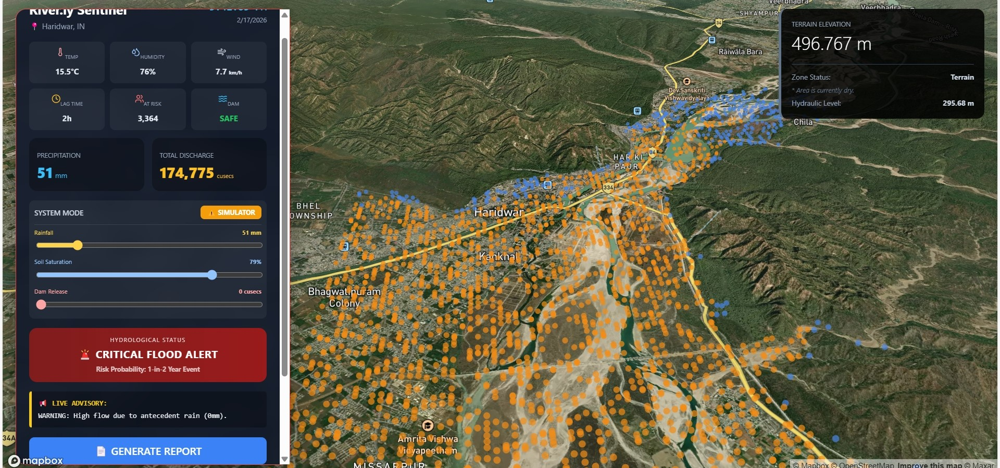
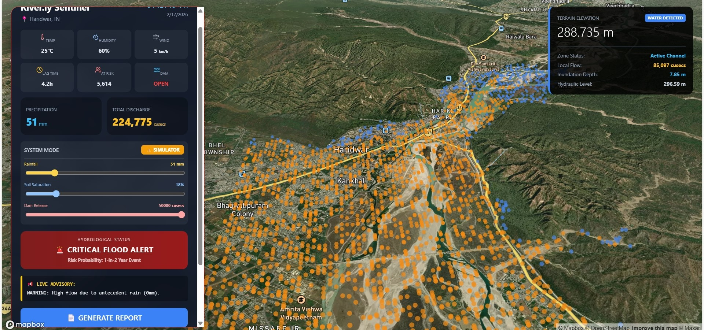
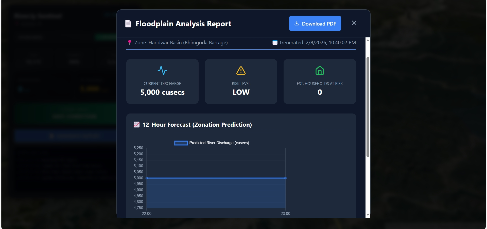
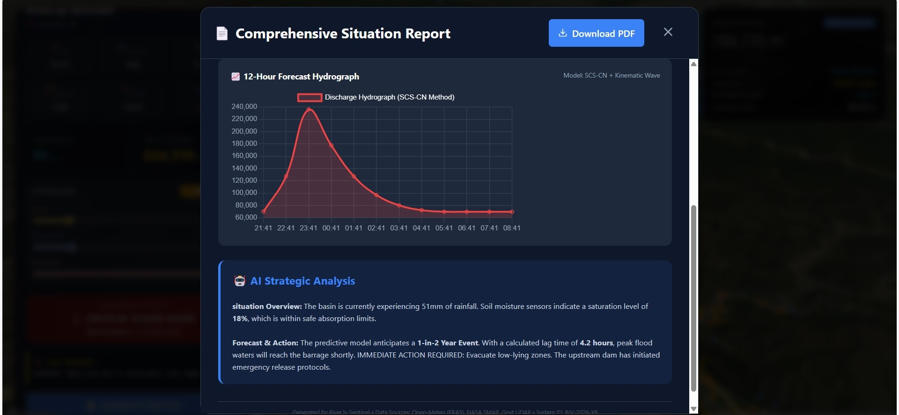

# Team Riverly

# AI-Driven River Health Dashboard

A next-generation **Hydrological Digital Twin & Flood Intelligence Platform** for the **Haridwar Ganga Basin**.  
Riverly combines real-time weather telemetry, physics-based watershed modeling, AI prediction, and LiDAR terrain intelligence to simulate flood behavior and generate actionable disaster insights before crisis escalation.

<p align="center">
  <a href="https://github.com/Kyash04/Riverly-Sentinel">
    
  </a>
  <a href="https://github.com/Kyash04/Riverly-Sentinel">
    
  </a>
  <a href="https://github.com/Kyash04/Riverly-Sentinel">
    
  </a>
  <a href="LICENSE">
    
  </a>
</p>

<br/>

Explore the Docs · View Demo · Report Bug · Request Feature

---

# Table of Contents

1. About The Project  
2. Key Features  
3. Technology Stack  
4. Getting Started  
   - Prerequisites  
   - Installation & Setup  
   - Manual Data Setup  
5. Usage  
6. Screenshots  
7. Project Structure  
8. Roadmap  
9. Contributors  
10. Acknowledgments  

---

# About The Project

River Health Dashboard solves a major limitation in traditional flood monitoring systems — **static flood maps that fail during dynamic climate events**.

Instead of relying only on gauges or historical thresholds, Riverly creates a **live Digital Twin of the river basin** that continuously simulates hydrological behavior using:

- Real-time rainfall telemetry
- Basin soil saturation memory
- Terrain elevation from high-resolution LiDAR
- Physics-guided runoff modeling
- AI risk classification

The system estimates river discharge, predicts flood propagation, and visualizes inundation risk spatially in 3D.

Unlike conventional dashboards, Riverly allows disaster authorities to simulate extreme scenarios using a dedicated **“God Mode” Simulation Engine**, instantly observing how rainfall, soil moisture, or dam releases impact downstream flooding.

---

# Key Features

## AI-Powered Forecasting Engine

- Physics-guided AI model trained on historical hydrological patterns.
- Predicts **river discharge (cusecs)** and flood risk levels:
  - Safe
  - Warning
  - Critical
- Generates a **12-Hour Forward Forecast Hydrograph**.
- Combines ML predictions with watershed runoff estimation.

---

## Hydrological Digital Twin Simulation

- Real-time distributed runoff modeling across basin points.
- Basin memory using soil moisture accumulation.
- Continuous recalculation of discharge based on:
  - Rainfall intensity
  - Soil saturation
  - Dam release conditions
- Instant visualization of flood evolution.

---

## Precision LiDAR Zonation & 3D Visualization

- Sub-meter terrain elevation from official GeoTIFF LiDAR datasets.
- Automated danger-zone detection using terrain thresholds.
- Realistic terrain rendering via Mapbox GL JS.
- Click-anywhere hydraulic inspection showing:
  - Local elevation
  - Estimated flood depth
  - Water level projection.

---

## “God Mode” Simulation Suite

- Dedicated sandbox environment for scenario testing.
- Inject extreme weather conditions instantly.
- Simulate theoretical flood waves before real events occur.
- Observe AI response and discharge escalation in real time.

---

## Automated Actionable Reporting

- One-click generation of professional **Floodplain Analysis PDF Reports**.
- Includes:
  - Forecast charts
  - Live telemetry snapshot
  - Estimated households at risk
  - AI-generated advisory text.

---

## High-Performance Geospatial Querying

### Smart Coordinate Optimization
Implements precision rounding (~11m grid) to group nearby elevation queries efficiently.

### Near Zero-Latency Response
Optimized LiDAR lookups minimize disk I/O, enabling fast terrain analysis even under continuous interaction.

---

## Technical Architecture

### Backend Architecture (Python / Flask)
The backend acts as the computational core of the Digital Twin.
* **Physics Layer:** Implements the **SCS-CN** method to calculate direct runoff. It incorporates a Linear Rating Curve to translate discharge volume into water surface elevation (WSE) and uses Manning's Approximation to distribute local flow velocity based on channel depth.
* **AI Layer:** A Random Forest Classifier acts as the decision support system. Trained on ERA5-Land Reanalysis data, it evaluates non-linear risk factors including antecedent rainfall and soil moisture saturation.
* **Geospatial Processing:** Uses **Rasterio** to process high-resolution GeoTIFF LiDAR models. A pre-compiled `catchment_points.csv` acts as a geospatial index, allowing the backend to execute over 3,000 differential equations in milliseconds without parsing raw tiles on every request.

### Frontend Architecture (React / Vite)
The frontend serves as the interactive control room.
* **3D Visualization Engine:** Built on **Mapbox GL JS**, rendering a 3D terrain layer with 1.5x vertical exaggeration to emphasize topography. Dynamic flood extents update at 1000ms polling intervals.
* **State Management:** Utilizes React `useRef` hooks extensively to prevent stale closures within Mapbox click listeners, ensuring the inspection tool always evaluates terrain against the latest simulation discharge state.
* **Reporting System:** Integrates **Chart.js** to render dynamic 12-hour hydrographs and utilizes `html2canvas`/`jspdf` for client-side serialization of the DOM into professional situation reports.

---

# Technology Stack

| Category | Technology |
| :--- | :--- |
| **Frontend** |     |
| **Backend API** |   |
| **AI & ML** |    |
| **Geospatial** |   |
| **Data Sources** | ERA5-Land Reanalysis (via Open-Meteo), Govt LiDAR DEMs |


---

# Getting Started

Follow these steps carefully to run the project locally.

---

## Prerequisites

- Python (v3.9 or newer)
- Node.js (v16 or newer)
- Git

---

## Installation & Setup

### 1. Clone the Repository

```bash
git clone https://github.com/Kyash04/Riverly-Sentinel
cd Riverly-Sentinel
```

#### 2. Backend Setup (Python/Flask)

Navigate to the root directory and install the required Python libraries.

```bash
# Ensure you are in the root /Riverly-Sentinel directory
pip install -r requirements.txt
```

#### 3. Frontend Setup (React)

Open a new terminal, navigate to the frontend folder, and install dependencies.

```bash
cd frontend
npm install
```

### THE CRITICAL MANUAL STEP (LiDAR DATA)

**STOP!** You cannot run the application yet. Due to GitHub file size limits, the massive LiDAR datasets are not included in the repo. You must add them manually.

> **Action Required:**
>
> 1.  Create a new folder named **`tiles`** inside the project root directory (`/Riverly-Sentinel/tiles/`).
> 2.  **Download** the high-resolution `.tif` files from the provided shared team drive location (Folder: `NHP_3_14`).
> 3.  **Paste all `.tif` files** directly inside your newly created `tiles` folder.

_Failure to do this will result in the backend crashing upon startup as it cannot find the terrain data._

## Usage

Once the installation and manual data setup are complete, you need to run two terminals simultaneously.

#### Terminal 1: The Backend Brain & AI

```bash
# Make sure you are in the root folder

# 1. Train the AI Model (Only needs to be run once)
python train_flood_ai.py

# 2. Scan LiDAR for Danger Zones (Only needs to be run once)
# This generates the death_zones.json file for the frontend
python scan_risk.py

# 3. Start the Flask API Server
python app.py
```

#### Terminal 2: The Frontend Interface

```bash
cd frontend
npm run dev
```

The application will launch in your browser at `http://localhost:5173 `

## Screenshots

### 1. The Main Dashboard (Live Mode)

_Real-time telemetry showing safe conditions, with LiDAR inspection points visible along the river bank._



### 2. "God Mode" Simulation (Critical Flood)

_Manual injection of rainfall, soil saturation and the dam release triggering the AI model. The map instantly visualizes the danger zones in red, the warning zones in orange and the safe zones in blue based on LiDAR data._





### 3. Automated PDF Report Generation

_An actionable report generated instantly, showing the 12-hour forecast curve and household risk assessment._



## Project Structure

A high-level overview of the project's architecture.

```bash
Riverly-Sentinel/
├── frontend/                  # React Frontend Directory
│   ├── public/                # Static assets (death_zones.json lives here after scan)
│   ├── src/
│   │   ├── components/        # Reusable UI components (ReportModal.jsx)
│   │   ├── App.jsx            # Main application logic & Mapbox Integration
│   │   └── main.jsx           # Entry point
│   ├── package.json           # Frontend dependencies
│   └── vite.config.js         # Vite configuration
├── tiles/                     # [MANUAL] Folder holding GBs of .tif LiDAR files
│   ├── NHP_2253313.tif        # (Example file)
│   └── ...
├── .gitignore                 # Specifies files to ignore in git
├── app.py                     # Core Flask Backend Server & API endpoints
├── flood_model.pkl            # Trained Random Forest AI Model (Binary)
├── requirements.txt           # Backend Python dependencies
├── scan_risk.py               # Utility script to process LiDAR & define danger zones
├── train_flood_ai.py          # Utility script to fetch historical data & train AI
└── README.md                  # Project documentation
```

## Roadmap

- [ ] **Satellite Radar Integration:** Incorporate Sentinel-1 SAR data for real-time flood extent mapping during cloud cover.
- [ ] **Mobile Alert App:** A companion mobile application for push notifications to residents in danger zones.
- [ ] **Multi-Basin Support:** Scaling the architecture to support other flood-prone river basins in India.
- [ ] **IoT Sensor Fusion:** Integrating ground-based river gauge sensors for hyper-local validation of AI predictions.

## Contributors

Made by **Team River.ly** for **[RIVERATHON]**.

- **Yash Kumar** - [LinkedIn](linkedin.com/in/yash-kumar-dev) | [GitHub](https://github.com/Kyash04)
- **Swati Bharti** - [LinkedIn](https://www.linkedin.com/in/swati-bharti-29sb) | [GitHub](https://github.com/swati-bharti29)
- **Nishu Priya** - [LinkedIn](linkedin.com/in/nishupriya0) | [GitHub](https://github.com/NishuPriya01)
- **Kunal Kumar Jha** - [LinkedIn](https://www.linkedin.com/in/kunal-jha45) | [GitHub](https://github.com/Sasrirr)

## Acknowledgments

Special thanks to the open-source community and the creators of the libraries used in this project:

- **Amity University Noida** For providing the crucial high-resolution LiDAR GeoTIFF data.
- **Open-Meteo:** For their excellent historical and live weather APIs.
- **Mapbox:** For the powerful 3D mapping and visualization platform.
- **React & Chart.js:** For the frontend framework and data visualization tools.